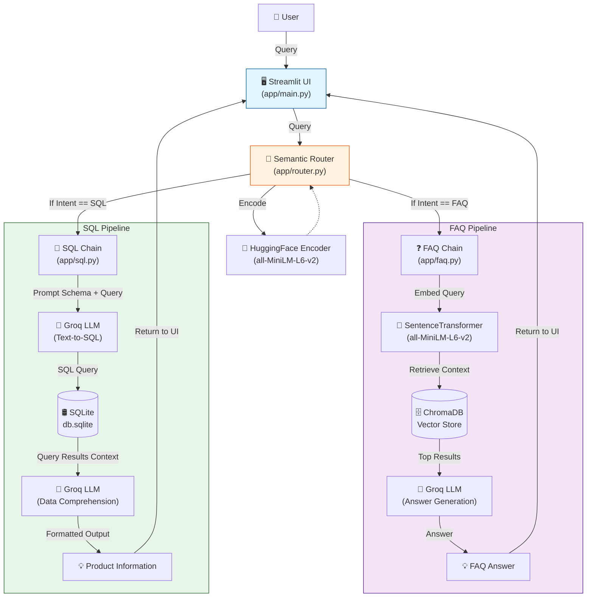

# 💬 e-commerce chatbot (Gen AI RAG project using LLama3.3 and GROQ)

This is POC of an intelligent chatbot tailored for an e-commerce platform, enabling seamless user interactions by accurately identifying the intent behind user queries. It leverages real-time access to the platform's database, allowing it to provide precise and up-to-date responses.

Folder structure
1. app: All the code for chatbot
2. web-scraping: Code to scrap e-commerce website 

This chatbot currently supports two intents:

- **faq**: Triggered when users ask questions related to the platform's policies or general information. eg. Is online payment available?
- **sql**: Activated when users request product listings or information based on real-time database queries. eg. Show me all nike shoes below Rs. 3000.


## Architecture




### Set-up & Execution

1. Run the following command to install all dependencies. 

    ```bash
    pip install -r app/requirements.txt
    ```

1. Inside app folder, create a .env file with your GROQ credentials as follows:
    ```text
    GROQ_MODEL=<Add the model name, e.g. llama-3.3-70b-versatile>
    GROQ_API_KEY=<Add your groq api key here>
    ```

1. Run the streamlit app by running the following command.

    ```bash
    streamlit run app/main.py
    ```
